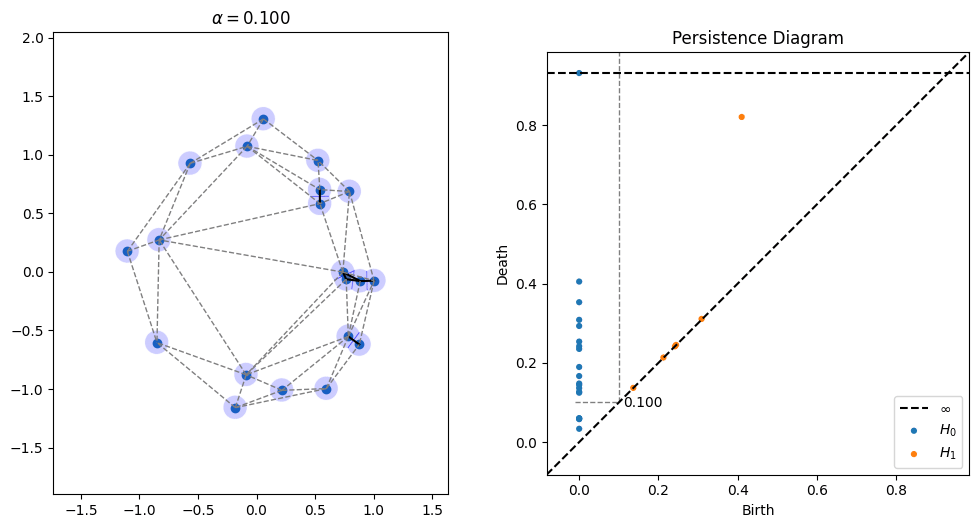
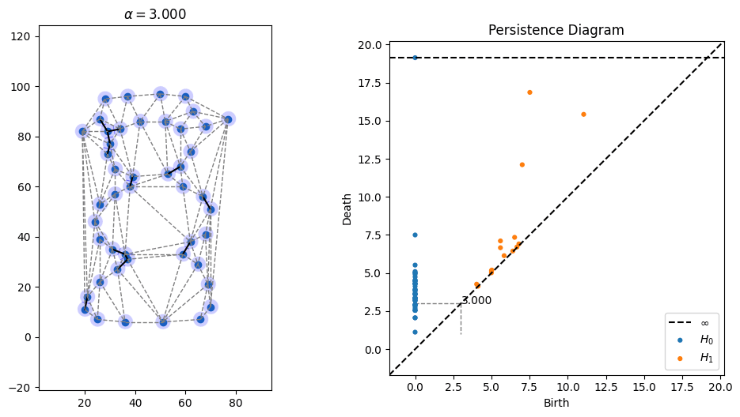

# AlphaAnim
Animations of alpha filtrations of 2D point clouds.  Run alpha.py to execute it.  Code can handle drawing a 2D point cloud as a collection of black pixels in an image

## Dependencies
* gudhi (pip install gudhi)
* persim (pip install persim)

## Examples

### Noisy Circle

### Snowman
